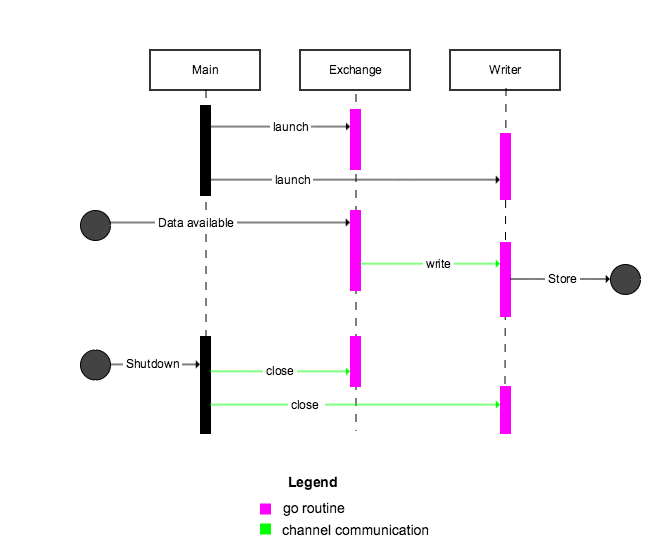

# Background
I wanted to learn Go Concurrency features and I came across Sameer Ajmani's excellent [talk](http://talks.golang.org/2013/advconc.slide#1). But concurrency is hard to learn just by reading and watching. The intent of this project was to 

  1. learn go concurrency patterns and 
  2. replace the existing data feeder at DCG 

I have done my best to document relevant parts of the code.

# Crypto Feeder
Get the ticker data from crypto exchanges and store them to different data stores.

## Goal
* The feeder fetches latest trades from different exchanges (in this case BTC exchanges) and feeds them into data stores via the writers
* There can be variety of data stores like files, log servers, distributed storages like kafka, cassandra, AWS and spark streaming

The project can be used for any exchanges, currency and asset types. Just implement the exchange interface (See example exchanges)

## Concurrency

* Each exchange is given a `broadcast` and a `close` channel. Exchanges fetch and parse data from their respective sources in a separate go-routine and send the data on the broadcast channel
* Exchanges listen in on the `close` channel and upon receiving close signal, exit the go-routine 
* Writers, similar to exchanges, are launched as a go-routine and are given a `broadcast` and a `close` channel. 
* Upon receiving data on the broadcast channel, writers then write to their respective storages

> Please note that our storages can handle duplicated trades on each request. For e.g. we have a reducer that acts as a valve and only allows unique transactions further down the chain.
> You can also use a traditional DB like Postgres or a NoSql cluster supported DB like Cassandra.

Below is a rough sketch of the concurrency model

# Running

To run the feeder,

* Create folder `bin` at the folder
* Build the executable `go build -o bin/crypto_feeder` at the root folder
* Create folder `/tmp/crypto_trades`
* Finally run `./bin/crypto_feeder`

# TODO

## High Priority
* Gracefully shut down go-routines that have failed due to IO related issues
* Use socket instead of http request to get trades as they come
* More tests

## Low
* Go workspaces
* More documentation

## Features
* Aggregator to create 30min and 1hr candles
* YAML Config files
